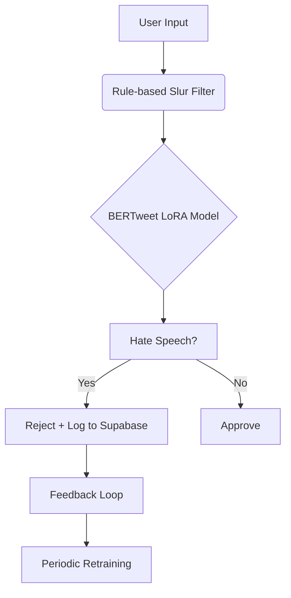
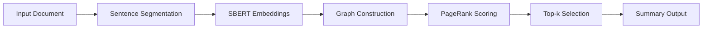

# 🚀 Project Portfolio

Detailed case studies of my technical projects with architecture, results, and lessons learned.

---

## 🛡️ AI-Powered Hate Speech Moderation

**Tech Stack:** `BERTweet` `LoRA` `FastAPI` `W&B` `Supabase` `Streamlit`

### 🎯 Overview
Three-tier moderation system that combines rule-based filtering with fine-tuned transformer models and continuous learning.

### 🏗️ System Architecture

### 📊 Results
- **84.5% Macro-F1** on 530k+ tweets (+4.5% over MetaHate baseline)
- **0.68 MCC** with only **1.4% of weights** updated via LoRA
- **Sub-second inference** via FastAPI on Hugging Face GPU
- **Live browser extension** for real-time Twitter/YouTube filtering

### 🎓 Lessons Learned
- LoRA effectiveness for efficient fine-tuning
- Importance of feedback loops for model improvement
- Trade-offs between precision and recall in moderation systems

---

## 📊 Graph-Based Extractive Summarization

**Tech Stack:** `SBERT` `PageRank` `Streamlit` `ROUGE` `NetworkX`

### 🎯 Overview
Research framework combining semantic embeddings with graph algorithms for automatic text summarization.

### 🏗️ Methodology

### 📊 Results
- **ROUGE L2-Norm ≈ 0.41** on CNN/DailyMail dataset
- **Ablation study** showing sentence-sentence edges as primary performance driver
- **~0.04 seconds/article** inference time optimization
- **Interactive Streamlit app** with real-time graph visualization

### 🎓 Research Insights
- Entity-aware graph construction provided marginal gains
- Sparse graph building crucial for performance
- Multi-embedder ensemble (SBERT + TF-IDF + BoW) showed robustness

---

## 🎯 Walmart Sales Forecasting

**Tech Stack:** `Plotly Dash` `Docker` `K-Means` `GMM` `Render` `XGBoost`

### 🎯 Overview
Comprehensive sales analysis and forecasting platform for strategic business intelligence.

### 📈 Key Features
- **Multi-tab dashboard** for 45 stores × 98 departments
- **Time-series analysis** with holiday vs. non-holiday comparisons
- **Economic indicator integration** (CPI & fuel prices)
- **Store/department clustering** for targeted strategy

### 📊 Business Impact
- **Store segmentation**: 4 tiers ($88M → $25M revenue bands)
- **Department clustering**: 3 tiers (22 top, 55 mid, 4 laggards)
- **Recidivism prediction**: 98-100% accuracy with XGBoost
- **Dockerized deployment** on Render for analyst access

### 🎓 Technical Learnings
- RFE/VIF feature selection outperformed PCA/UMAP for tabular data
- KNN imputation effective for missing value handling
- GMM provided more nuanced clustering than K-Means alone

---

## 🔬 U.S. Crime Data Analysis

**Tech Stack:** `Python` `Plotly` `XGBoost` `UMAP` `RFE` `VIF`

### 📊 Key Findings
- **Larceny-theft dominance** in crime composition
- **Alaska's 40% violent crime rate** outlier identification  
- **Post-2020 homicide surge** trend analysis
- **Firearm laws impact**: No significant reduction (p=0.383, 2010-2020)

### 🎓 Analytical Approach
- Comprehensive EDA with interactive Plotly dashboards
- Statistical testing (t-tests) for policy impact assessment
- Feature engineering for recidivism risk modeling
