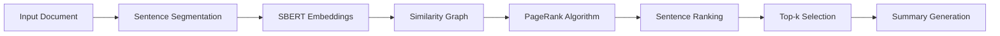

# 👋 Hello, I'm Mahmoud El-Bahnasawi

**ML Engineer | Building Production-Ready NLP Systems**

I build and deploy practical machine learning systems with a strong focus on NLP applications. I take concepts from research to production, creating efficient solutions that actually work in the real world.

---

## 🚀 What I Do

- 🔭 **Practical NLP:** Fine-tuning transformer models for real applications
- 🎯 **Production Focus:** Taking models from notebooks to deployed services
- 📊 **Clear Communication:** Creating visualizations and documentation that make complex ideas understandable
- 📝 **System Design:** Using **Mermaid diagrams** to plan and explain architectures
- 🏗️ **Clean Code:** Writing maintainable, well-documented production code
- ⚡ **Performance Matters:** Optimizing for real-world usage and speed

---

## 🛠️ Tech Stack & Tools

### **🤖 Core ML & NLP**

### **🎨 ML Frontend & Visualization**

### **📊 Data Manipulation**

### **⚡ Deployment & Tools**

---

## 💡 Featured Projects

### 🛡️ AI-Powered Hate Speech Moderation

<b>BERTweet · LoRA · FastAPI · Streamlit · 84.5% Macro-F1</b>

#### 🎯 Overview
Three-tier moderation system that actually works - combining rule-based filtering with fine-tuned transformer models.

#### 🏗️ System Architecture

#### 📊 What I Delivered
- **84.5% Macro-F1** on 530k+ tweets (beating MetaHate by +4.5%)
- **LoRA efficiency** - updated only 1.4% of weights
- **Sub-second inference** via FastAPI on Hugging Face GPU
- **Full-stack system** - from browser extension to feedback database
- **Production deployment** with real-time processing

#### 🔗 Links
[GitHub Repository](https://github.com/El-Bahnasawi/AI-Powered-Textual-Hate-Content-Moderation) · [Streamlit Demo](https://hate-speech-detection-app.streamlit.app/) · [W&B Logs](https://wandb.ai/medoxz543-zewail-city-of-science-and-technology/Textual%20Hate%20Content%20Moderation%20with%20BERTweet%20%2B%20LoRA?nw=nwusermedoxz543) · [Hugging Face Model](https://huggingface.co/medoxz543/hate-speech)

### 📊 Graph-Based Extractive Summarization

<b>SBERT · PageRank · Streamlit · ROUGE L2 ≈ 0.41</b>

#### 🎯 Overview
Research project combining semantic embeddings with graph algorithms for automatic text summarization.

#### 🔬 What I Built

#### 📊 Results That Matter
- **ROUGE L2-Norm ≈ 0.41** on CNN/DailyMail dataset
- **Ablation study** showing what actually works
- **~0.04 seconds/article** - optimized for real usage
- **Interactive Streamlit app** with live visualization

#### 🔗 Links
[GitHub Repository](https://github.com/El-Bahnasawi/Graph-Based-Text-Summarization) · [Streamlit Demo](https://graph-based-text-summarization.streamlit.app/)

### 🎯 Walmart Sales Forecasting

<b>Plotly Dash · Docker · K-Means · GMM · Render</b>

#### 🎯 Overview
Practical business intelligence platform for retail analytics and forecasting.

#### 📈 Real Business Value
- **Store segmentation** - 4 tiers based on $88M → $25M revenue
- **Department clustering** - 3 performance tiers
- **Holiday impact analysis** - 42% sales increase identified
- **Deployed dashboard** - used by analysts for decision making

#### 🏗️ Technical Implementation
- **Multi-tab Plotly Dash** for 45 stores × 98 departments
- **Dockerized deployment** on Render
- **Cluster analysis** using K-Means & GMM
- **Time-series forecasting** with economic indicators

#### 🔗 Links
[GitHub Repository](https://github.com/El-Bahnasawi/Walmart-Dataset-Analysis) · [Live Dashboard](https://walmart-dataset-analysis.onrender.com/)

### 🔬 U.S. Crime Data Analysis

<b>XGBoost · Plotly · Statistical Analysis</b>

#### 📊 Analytical Approach
Comprehensive analysis of 30 years of crime data to find meaningful patterns.

#### 🔎 Key Insights
- **Larceny-theft dominance** - 57.4% of all crimes
- **Alaska outlier** - 40% violent crime rate
- **Post-2020 surge** - 28% homicide increase
- **Policy impact** - no significant firearm law effects (p=0.383)

#### 🎯 Predictive Modeling
- **Recidivism risk** - 98-100% accuracy with XGBoost
- **Feature selection** - RFE/VIF for interpretable models
- **Interactive dashboards** - for hypothesis exploration

#### 🔗 Links
[GitHub Repository](https://github.com/El-Bahnasawi/Analyzing-U.S.-Crime-Data)

---

## 🚀 Growing My Skills

- **RAG systems** - retrieval-augmented generation for knowledge-intensive tasks
- **Advanced MLOps patterns** - model monitoring, CI/CD for ML
- **Cloud infrastructure** - Azure and AWS for scalable deployments
- **System design** - building more complex, distributed systems

---

## 📫 Let's Connect

