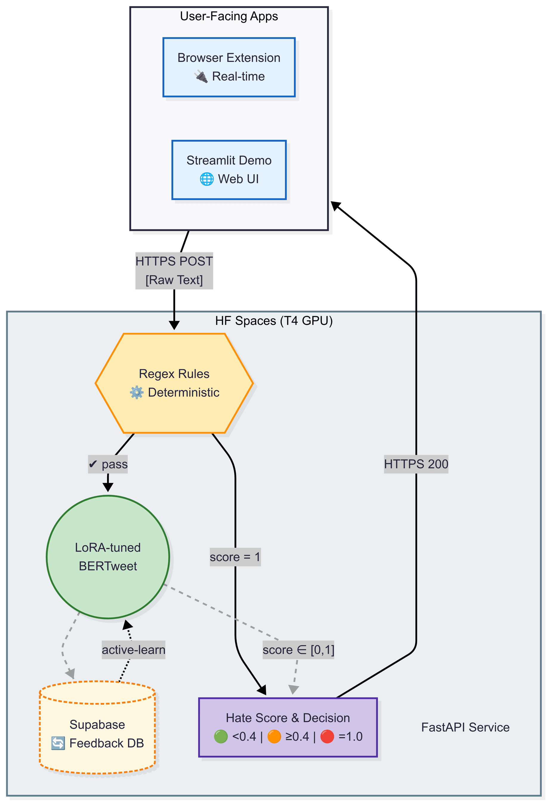

# 👋 Mahmoud El-Bahnasawi

**ML engineer shipping NLP systems**  
Built sub-second hate-speech moderation with **BERTweet + LoRA**, FastAPI on GPU, and real user feedback.

**Live:** **[Repo](https://github.com/El-Bahnasawi/AI-Powered-Textual-Hate-Content-Moderation)** • **[Demo](https://hate-speech-detection-app.streamlit.app/)** • **[W&B](https://wandb.ai/medoxz543-zewail-city-of-science-and-technology/Textual%20Hate%20Content%20Moderation%20with%20BERTweet%20%2B%20LoRA?nw=nwusermedoxz543)** • **[Model](https://huggingface.co/medoxz543/hate-speech)**

---

## 🔥 Highlights

- **84.5% Macro-F1** on 530k+ tweets (**+4.5% over MetaHate**)
- **LoRA fine-tuning** with **1.4% weight updates** - efficient and effective
- **Sub-second inference** via FastAPI on Hugging Face GPU
- **Full-stack system**: browser extension → API → feedback DB → active learning

---

## 🚀 What I Build

- **Production NLP**: Fine-tuned transformers that actually ship
- **Measurable Systems**: Clear latency and accuracy targets from day one  
- **User-Facing ML**: Demos and extensions that validate real-world usefulness
- **Instrumented Workflows**: W&B for honest, reproducible metrics
- **Feedback Loops**: Systems that learn from real user interactions

---

## 🛠️ Stack

---

## 🛡️ AI-Powered Hate Speech Moderation

### TL;DR
Three-tier pipeline: **regex pre-filter** → **LoRA-tuned BERTweet** → **decision service**. Real-time moderation via browser extension and web UI, with Supabase feedback for continuous learning.

### System Architecture

### Results
- **84.5% Macro-F1** on 530k+ tweets (beats MetaHate by +4.5%)
- **1.4% weights updated** via LoRA - highly parameter-efficient
- **Sub-second inference** on GPU-backed FastAPI
- **Active learning** pipeline with Supabase feedback storage

### Decision Logic
| Hate Score | Action | UI |
|------------|--------|-----|
| < 0.40 | Allow | 🟢 |
| 0.40 - 0.99 | Flag/Review | 🟠 |
| = 1.00 | Block | 🔴 |

### Live
- **Code**: https://github.com/El-Bahnasawi/AI-Powered-Textual-Hate-Content-Moderation  
- **Demo**: https://hate-speech-detection-app.streamlit.app/
- **Metrics**: https://wandb.ai/medoxz543-zewail-city-of-science-and-technology/Textual%20Hate%20Content%20Moderation%20with%20BERTweet%20%2B%20LoRA
- **Model**: https://huggingface.co/medoxz543/hate-speech

---

## 📚 Other Projects

### 📊 Graph-Based Text Summarization

SBERT · PageRank · ROUGE L2 ≈ 0.41 · Streamlit

- Semantic graph summarization with SBERT + PageRank
- **ROUGE L2 ≈ 0.41** on CNN/DailyMail
- **~0.04s/article** inference, interactive visualization

**Repo**: https://github.com/El-Bahnasawi/Graph-Based-Text-Summarization  
**Demo**: https://graph-based-text-summarization.streamlit.app/

### 🎯 Walmart Sales Analytics  

Plotly Dash · Docker · Clustering · Render

- Multi-tab dashboard for 45 stores × 98 departments
- Store segmentation (4 tiers) and holiday impact analysis
- Dockerized deployment on Render

**Repo**: https://github.com/El-Bahnasawi/Walmart-Dataset-Analysis  
**Live**: https://walmart-dataset-analysis.onrender.com/

### 🔬 U.S. Crime Analysis

XGBoost · Statistical Testing · Plotly

- 30-year trend analysis and policy impact assessment
- Recidivism prediction (98-100% accuracy) with interpretable features

**Repo**: https://github.com/El-Bahnasawi/Analyzing-U.S.-Crime-Data

---

## 🎯 Focus Areas

- **Production NLP**: Fine-tuning, optimization, and deployment
- **ML Systems**: End-to-end pipelines with monitoring and feedback
- **Practical MLOps**: Experiment tracking, deployment, and iteration

---

## 📫 Reach Out

